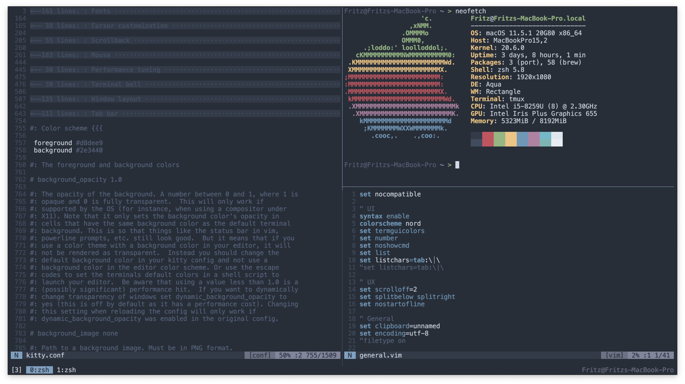

# Dotfiles

## What are dotfiles?
Dotfiles are the configuration files that are used to personalise Unix-based systems. Dotfiles are hidden files or directories which have names that start with a dot/period.\
This repository contains my personal dotfiles. They are stored here for convenience so that I can quickly access them on new machines. Also, others may find some of my configurations helpful in customising their own dotfiles.

## Featured applications
* [neovim](https://github.com/neovim/neovim): [`nvim/`](../.config/nvim)
* [tmux](https://github.com/tmux/tmux): [`.tmux.conf`](../.tmux.conf)
* [zsh](https://www.zsh.org/): [`.zshrc`](../.zshrc)
* [kitty](https://github.com/kovidgoyal/kitty): [`kitty.conf`](../.config/kitty/kitty.conf)

## Some other CLI tools I use
* [fzf](https://github.com/junegunn/fzf): fuzzy finder
* [todo.sh](https://github.com/todotxt/todo.txt-cli): minimal todo list
* [wttr.in](https://github.com/chubin/wttr.in): weather forecast

## How to store dotfiles in a git repository
Here is the article that I used to set up this git repository: https://www.atlassian.com/git/tutorials/dotfiles
